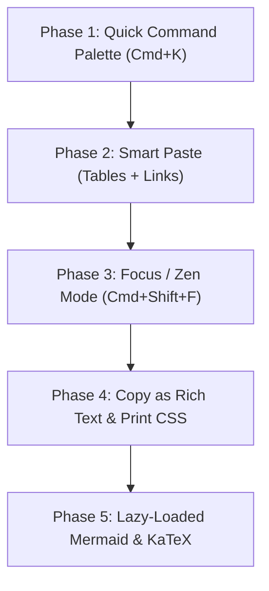

# Mandrak — Features Roadmap v2 (High-Velocity & Zero-Bloat)

**Target:** Elevate writing velocity, productivity, and preview power without compromising Mandrak's **0ms instant load times**.  
**Selected Features:** All Tier 1 Core Superpowers + Mermaid & KaTeX Math Rendering (Tier 2 Lazy-Loaded).  
**Status:** Planned  

---

## 🎯 Architectural Principle: "Power Without Bloat"
Every feature added to Mandrak must satisfy two rules:
1. **Zero Cold-Start Overhead**: Dynamic imports (`import()`) for heavy libraries (KaTeX, Mermaid) so the base bundle stays tiny.
2. **Keyboard-First Flow**: Fast shortcuts (`⌘K`, `⌘⇧F`, `⌘⇧C`) for instant, friction-free operation.

---

## ⚡ Feature 1: Quick Command Palette (`Cmd+K` / `Cmd+P`)

### Overview
A Spotlight/Alfred-style modal dialog that allows users to instantly search notes, switch files, toggle themes, change storage providers, and trigger actions using purely the keyboard.

### Key Capabilities
- **Fuzzy File Search**: Instant fuzzy matching across all note titles and folder paths.
- **Quick Action Commands**:
  - `> New Note` (`Cmd+N`)
  - `> Switch Storage Provider` (Local / Drive / Dropbox / OneDrive / GitHub)
  - `> Toggle Dark / Light Theme`
  - `> Toggle Live Preview / Split Mode` (`Cmd+P`)
  - `> Enter Focus / Zen Mode` (`Cmd+Shift+F`)
  - `> Copy Note as Rich Text`
  - `> Trigger AI Assistant` (`Cmd+J`)
- **Recent Notes History**: Arrow keys (`↑`/`↓`) to navigate recent files without typing.

### Technical Implementation
- Lightweight modal overlay with backdrop blur.
- Fast client-side fuzzy matcher (e.g. lightweight bitap/levenshtein or regex-based scoring, < 3KB).
- Global keyboard listener for `Cmd+K` and `Ctrl+K`.

---

## 📋 Feature 2: Smart Paste Superpowers

### Overview
Eliminate the manual formatting pain of copying tables, URLs, and formatted text from other apps into Markdown.

### Key Capabilities
1. **Spreadsheet Table to Markdown Table**:
   - Pasting tabular data copied from Excel, Google Sheets, Airtable, or HTML tables automatically converts to GitHub-Flavored Markdown table syntax:
     ```markdown
     | Column 1 | Column 2 | Column 3 |
     | :--- | :--- | :--- |
     | Value A | Value B | Value C |
     ```
2. **Smart URL Auto-Link**:
   - Selecting a word/phrase (e.g. `Mandrak Editor`) and pressing `Cmd+V` with a URL on the clipboard automatically converts it to:
     `[Mandrak Editor](https://example.com)` instead of replacing the selected text.
3. **Clean Markdown Paste**:
   - Pasting rich text from external websites strips unwanted styling artifacts while preserving clean headers, bold, italics, and lists.

### Technical Implementation
- Custom TipTap `handlePaste` editor plugin intercepting `clipboardData.getData('text/html')` and `clipboardData.getData('text/plain')`.
- Table parser detects tab-separated values (TSV) or `<table>` HTML tags and converts to clean pipe tables.

---

## 🧘 Feature 3: Focus / Zen Mode (`Cmd+Shift+F`)

### Overview
A distraction-free writing environment that maximizes screen real estate and keeps the writer in a state of flow.

### Key Capabilities
- **Full Chrome Dismissal**: Smoothly fades out the left sidebar, file tree, top navigation header, and status bar.
- **Centered Prose Canvas**: Elegant centered reading column (`max-width: 840px`) with comfortable margins.
- **Typewriter Scrolling (Optional Toggle)**:
  - Automatically keeps the active line of text vertically centered on the screen as you type, preventing neck strain from typing at the bottom of the viewport.
- **Hover Reveal**: Moving cursor to the top or left screen edge gently fades controls back in.
- **Instant Exit**: Pressing `Esc` or `Cmd+Shift+F` returns seamlessly to the standard multi-pane view.

### Technical Implementation
- CSS state class `.zen-mode` applied to top-level container with CSS transitions (`opacity`, `transform`).
- TipTap scroll extension or standard scroll listener calculating cursor line offset for typewriter positioning.

---

## 📤 Feature 4: Copy as Rich Text & Clean Export

### Overview
Allow users to write in Markdown but share everywhere seamlessly (email, Slack, Google Docs, Notion, Word, PDF).

### Key Capabilities
1. **One-Click "Copy as Rich Text" (`Cmd+Shift+C`)**:
   - Renders current markdown via `marked` and writes both `text/html` and `text/plain` to the system clipboard using `navigator.clipboard.write([new ClipboardItem(...)])`.
   - Pasting into Gmail, Outlook, Slack, or Google Docs retains full bold, headings, code formatting, bullet lists, and links.
2. **Clean PDF Print Stylesheet (`@media print`)**:
   - Clean, professional document layout when using `Cmd+P` / Print to PDF.
   - Hides sidebars, headers, buttons, line numbers, and dark backgrounds; outputs crisp black-on-white serif/sans typography with proper page break rules.

---

## 📊 Feature 5: Mermaid Diagrams & KaTeX Math (Lazy-Loaded)

### Overview
Rich visual diagrams and mathematical formulas rendered directly in the Live Preview and Reader modes.

### Key Capabilities
1. **Mermaid.js Diagrams**:
   - Render ````mermaid` code blocks into crisp SVG diagrams (flowcharts, sequence diagrams, architecture charts, gantt charts, git graphs).
   - Automatically adapts diagram theme to Mandrak's Dark or Light theme.
2. **KaTeX Mathematical Equations**:
   - Render inline equations: `$E = mc^2$`
   - Render block equations:
     ```latex
     $$\int_{-\infty}^{\infty} e^{-x^2} dx = \sqrt{\pi}$$
     ```

### ⚡ Performance & Zero-Bloat Architecture
- **Dynamic On-Demand Loading**: `mermaid` and `katex` are heavy libraries. They will **never** be loaded on initial page startup.
- **Detection Trigger**: When parsing markdown in `PreviewPane.tsx` or `ReaderMode.tsx`:
  - If content contains ````mermaid`, dynamically invoke `import('mermaid')`.
  - If content contains `$` or `$$`, dynamically invoke `import('katex')`.
- Initial application bundle impact: **0 KB overhead**.

---

## 🛠️ Implementation Phases & Dependencies



| Feature | Target File Locations | Bundle Impact | Key Shortcut |
| :--- | :--- | :--- | :--- |
| **Command Palette** | `src/components/CommandPalette.tsx` | ~3 KB | `⌘K` / `Ctrl+K` |
| **Smart Paste** | `src/editor/extensions/smartPaste.ts` | ~1.5 KB | `⌘V` / `Ctrl+V` |
| **Focus / Zen Mode** | `src/layout/ZenMode.tsx`, `App.css` | 0 KB (CSS-driven) | `⌘⇧F` / `Ctrl+Shift+F` |
| **Copy as Rich Text** | `src/utils/exportUtils.ts` | ~0.5 KB | `⌘⇧C` / `Ctrl+Shift+C` |
| **Mermaid & KaTeX** | `src/preview/renderers/lazyEngines.ts` | **0 KB cold** (Lazy loaded) | Automatic on preview |
