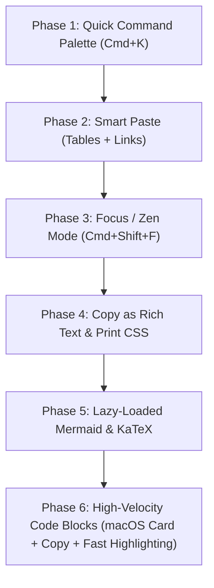

# Mandrak — Features Roadmap v2 (High-Velocity & Zero-Bloat)

**Target:** Elevate writing velocity, productivity, and preview power without compromising Mandrak's **0ms instant load times**.  
**Architectural North Star:** 100% Client-Side Privacy, Universal Markdown Portability, 0ms Typing Latency, Zero Cold-Start Bloat.  
**Status:** Planned & Prioritized  

---

## 🏔️ The Mandrak Development Philosophy

Every feature considered for Mandrak is evaluated against 4 non-negotiable architectural pillars:

```text
┌─────────────────────────────────────────────────────────────────────────────┐
│ 1. 0ms Cold-Start & Zero-Bloat  ──► No heavy upfront bundles; 60/120 FPS    │
│ 2. Distraction-Free Flow        ──► Friction-free, keyboard-first velocity  │
│ 3. Local-First & 100% Private   ──► Native FS / direct cloud, no lock-in    │
│ 4. Universal Markdown Standard  ──► Pure GFM/CommonMark portability         │
└─────────────────────────────────────────────────────────────────────────────┘
```

### 📋 Feature Evaluation & Omission Matrix

| Feature | Mandrak Alignment | Bundle Impact | Decision & Rationale |
| :--- | :---: | :---: | :--- |
| **1. Command Palette** | **100%** (Pillars 2, 3) | ~3 KB | 🟢 **IMPLEMENT**: Fast keyboard navigation across all notes & actions. |
| **2. Smart Paste Superpowers** | **100%** (Pillars 2, 4) | ~1.5 KB | 🟢 **IMPLEMENT**: Eliminates spreadsheet & URL formatting friction. |
| **3. Focus / Zen Mode** | **100%** (Pillar 2) | 0 KB (CSS) | 🟢 **IMPLEMENT**: Pure distraction-free writing environment. |
| **4. Copy as Rich Text & Export** | **100%** (Pillars 2, 4) | ~0.5 KB | 🟢 **IMPLEMENT**: Frictionless sharing to Slack, Email, and Docs. |
| **5. Mermaid & KaTeX Rendering** | **85%** (Pillars 2, 4) | 0 KB Cold (Lazy) | 🟡 **IMPLEMENT WITH GUARDRAILS**: Dynamically loaded on-demand only. |
| **6. High-Velocity Code Blocks** | **80%** (Pillars 1, 2) | ~25 KB (Tree-shaken) | 🟡 **IMPLEMENT ESSENTIALS, CUT BLOAT**: macOS card + 1-click copy + core 15 languages. |
| **❌ Heavy 190+ Language Packs** | **0%** (Violates Pillar 1) | >1.2 MB | 🔴 **OMIT / CUT**: Massive bundle bloat that degrades startup times. |
| **❌ In-Editor DOM Dropdowns** | **10%** (Violates Pillar 1) | High CPU | 🔴 **OMIT / CUT**: ProseMirror React NodeViews cause typing lag. |
| **❌ Standalone Snippet DB UI** | **20%** (Violates Pillar 2) | High UI weight | 🔴 **OMIT / CUT**: Overkill for a markdown editor; use `⌘K` templates instead. |

---

## ⌨️ Global Keyboard Shortcut Architecture & Resolution

### The `⌘K` Shortcut Collision Analysis
Currently, there is an overlap in shortcut assignments:
1. **Left Sidebar Search**: `⌘K` currently focuses the left pane search bar when outside the editor.
2. **In-Editor Link**: `⌘K` in TipTap triggers the "Insert Link" prompt.
3. **Command Palette**: `⌘K` is the industry standard (Linear, Raycast, Slack, Notion) for the global Spotlight modal.

### 🎯 Resolved Unified Shortcut Mapping

| Intent | Assigned Shortcut | Behavior & Scope |
| :--- | :--- | :--- |
| **Command Palette (Spotlight Modal)** | `⌘K` / `Ctrl+K` (Global) | Opens floating Command Palette from anywhere to search files & actions. |
| **Sidebar File Tree Filter** | `⌘⇧F` / `Ctrl+Shift+F` (or `/`) | Expands left sidebar and focuses the quick filter input. |
| **Insert / Edit Link** | `⌘K` (when text is selected) / Smart Paste | Pressing `⌘K` on selected text inserts a link; pasting a URL over text auto-creates a markdown link. |
| **Cycle View Modes** | `⌘P` / `Ctrl+P` (or `⌘⇧V`) | Cycles through Edit ➔ Split ➔ Preview ➔ Network modes. |
| **Toggle Sidebar** | `⌘\` / `Ctrl+\` | Toggles left navigation sidebar collapse. |
| **Focus / Zen Mode** | `⌘⇧F` / `Ctrl+Shift+F` | Enters distraction-free full-screen writing canvas. |
| **Copy as Rich Text** | `⌘⇧C` / `Ctrl+Shift+C` | Copies rendered HTML + clean text to system clipboard. |
| **Insert Code Block** | `⌘⌥C` / `Ctrl+Alt+C` | Formats selection or creates empty code block fence. |

---

## ⚡ Feature 1: Quick Command Palette (`Cmd+K`)

### Overview
A Spotlight/Alfred-style modal dialog that allows users to instantly search notes, switch files, toggle themes, change storage providers, and trigger actions using purely the keyboard.

### Why We Are Implementing It
Maximizes writing velocity by eliminating mouse navigation. Users can switch notes and trigger any command in milliseconds.

### What We Are Implementing
- **Fuzzy File Search**: Instant fuzzy matching across all note titles and folder paths.
- **Quick Action Commands**:
  - `> New Note` (`⌘N`)
  - `> Switch Storage Provider` (Local / Drive / Dropbox / OneDrive / GitHub)
  - `> Toggle Dark / Light Theme`
  - `> Toggle Live Preview / Split Mode` (`⌘P`)
  - `> Enter Focus / Zen Mode` (`⌘⇧F`)
  - `> Copy Note as Rich Text` (`⌘⇧C`)
  - `> Trigger AI Assistant` (`⌘J`)
  - `> Insert Code Template` (React, Python, SQL, Fetch, etc.)
- **Recent Notes History**: Arrow keys (`↑`/`↓`) to navigate recent files without typing.

### Technical Implementation
- Lightweight modal overlay with backdrop blur.
- Fast client-side regex/scoring (< 3KB).
- Global keyboard listener for `⌘K` and `Ctrl+K`.

---

## 📋 Feature 2: Smart Paste Superpowers

### Overview
Eliminate the manual formatting pain of copying tables, URLs, and formatted text from other apps into Markdown.

### Why We Are Implementing It
Copying tables from Excel/Google Sheets and inserting links into markdown are two of the highest-friction actions in standard markdown editors.

### What We Are Implementing
1. **Spreadsheet Table to Markdown Table**:
   - Pasting tabular data copied from Excel, Google Sheets, Airtable, or HTML tables automatically converts to GitHub-Flavored Markdown table syntax:
     ```markdown
     | Column 1 | Column 2 | Column 3 |
     | :--- | :--- | :--- |
     | Value A | Value B | Value C |
     ```
2. **Smart URL Auto-Link**:
   - Selecting a word/phrase (e.g. `Mandrak Editor`) and pressing `⌘V` with a URL on the clipboard automatically converts it to:
     `[Mandrak Editor](https://example.com)` instead of replacing the selected text.
3. **Clean Markdown Paste**:
   - Pasting rich text from external websites strips unwanted styling artifacts while preserving clean headers, bold, italics, and lists.

### Technical Implementation
- Custom TipTap `handlePaste` editor plugin intercepting `clipboardData.getData('text/html')` and `clipboardData.getData('text/plain')`.
- Zero runtime overhead during regular typing.

---

## 🧘 Feature 3: Focus / Zen Mode (`Cmd+Shift+F`)

### Overview
A distraction-free writing environment that maximizes screen real estate and keeps the writer in a state of pure flow.

### Why We Are Implementing It
Directly fulfills Mandrak's identity as a focused, calm writing sanctuary ("Mountain of Knowledge").

### What We Are Implementing
- **Full Chrome Dismissal**: Smoothly fades out the left sidebar, file tree, top navigation header, and status bar.
- **Centered Prose Canvas**: Elegant centered reading column (`max-width: 840px`) with comfortable margins.
- **Typewriter Scrolling (Optional Toggle)**:
  - Keeps the active line of text vertically centered on the screen as you type.
- **Hover Reveal**: Moving cursor to the top or left screen edge gently fades controls back in.
- **Instant Exit**: Pressing `Esc` or `⌘⇧F` returns seamlessly to standard view.

### Technical Implementation
- CSS state class `.zen-mode` applied to top-level container with hardware-accelerated CSS transitions (`opacity`, `transform`).
- **0 KB JS Bundle Overhead**.

---

## 📤 Feature 4: Copy as Rich Text & Clean Export

### Overview
Allow users to write in Markdown but share everywhere seamlessly (email, Slack, Google Docs, Notion, Word, PDF).

### Why We Are Implementing It
Markdown writers frequently need to share notes with non-markdown users without going through cumbersome file export workflows.

### What We Are Implementing
1. **One-Click "Copy as Rich Text" (`Cmd+Shift+C`)**:
   - Renders current markdown via `marked` and writes both `text/html` and `text/plain` to the system clipboard using `navigator.clipboard.write([new ClipboardItem(...)])`.
   - Pasting into Gmail, Outlook, Slack, or Google Docs retains full bold, headings, code formatting, bullet lists, and links.
2. **Clean PDF Print Stylesheet (`@media print`)**:
   - Clean, professional document layout when using `Cmd+P` / Print to PDF.
   - Hides sidebars, headers, buttons, and dark backgrounds; outputs crisp black-on-white typography with proper page break rules.

---

## 📊 Feature 5: Mermaid Diagrams & KaTeX Math (Lazy-Loaded)

### Overview
Rich visual diagrams and mathematical formulas rendered directly in the Live Preview and Reader modes.

### Why We Are Implementing It
Enables technical documentation, engineering architecture diagrams, and academic formulas without breaking GFM compatibility.

### What We Are Implementing
1. **Mermaid.js Diagrams**:
   - Render ````mermaid` code blocks into crisp SVG diagrams (flowcharts, sequence diagrams, architecture charts, git graphs).
   - Automatically adapts diagram theme to Mandrak's Dark or Light theme.
2. **KaTeX Mathematical Equations**:
   - Render inline equations: `$E = mc^2$`
   - Render block equations: `$$\int_{-\infty}^{\infty} e^{-x^2} dx = \sqrt{\pi}$$`

### ⚡ Performance Guardrails (Zero-Bloat Architecture)
- **Dynamic On-Demand Loading**: `mermaid` (~800 KB) and `katex` (~250 KB) are heavy libraries. They will **never** be included in the initial bundle.
- **Detection Trigger**:
  - If content contains ````mermaid`, dynamically invoke `import('mermaid')`.
  - If content contains `$` or `$$`, dynamically invoke `import('katex')`.
- Initial application bundle impact: **0 KB overhead**.

---

## 💻 Feature 6: High-Velocity Code Blocks & Essential Snippets

### Overview
Desktop-grade, visually stunning code blocks with zero typing latency, macOS-inspired window frames, 1-click clipboard copying, and lightweight syntax highlighting.

### Why We Are Implementing It
Code blocks are central to technical note-taking, but they must not compromise typing performance or add megabytes of bloat.

### What We Are Implementing (The Essentials)
1. **macOS Code Card Frame & 1-Click Copy**:
   - Polished macOS title bar with colored window dots (`● ● ●`), clean language badge (e.g., `TypeScript`, `Python`, `Rust`, `SQL`), and an instant 1-click **"📋 Copy"** button that animates to **"✓ Copied!"**.
2. **Zero-Lag Syntax Highlighting (Top 15 Common Languages)**:
   - Ultra-fast syntax highlighting for the most common languages:
     `JavaScript`, `TypeScript`, `Python`, `HTML`, `CSS`, `JSON`, `SQL`, `Bash`, `Go`, `Rust`, `C`, `C++`, `Java`, `YAML`, `Markdown`.
   - Highlighting uses tree-shaken grammar tokens (~25 KB) to guarantee **0ms typing latency** and 0 cold-start penalty. Unrecognized languages fall back to clean monospace formatting.
3. **Quick Code Snippet Insertion via Command Palette (`Cmd+K`)**:
   - Insert popular boilerplate templates (React Component, Python Script, Fetch Request, SQL Table, Markdown Cheatsheet) directly from the Command Palette.

### 🚫 What We Are Omitting & Why
- ❌ **No Full 190+ Language Packs**: Avoids ~1.2 MB of unused syntax definitions.
- ❌ **No Heavy In-Editor TipTap NodeView Dropdowns**: Avoids complex ProseMirror React wrapper nodes that degrade 60 FPS typing performance on long documents. Users simply type standard markdown language identifiers (e.g. ```` ```python ````).
- ❌ **No Separate Snippet Database Manager**: Avoids complex storage schemas; templates are kept lightweight and fast inside `⌘K`.

---

## 🛠️ Implementation Phases & Dependencies



| Phase | Feature | Target File Locations | Bundle Impact | Key Shortcut |
| :--- | :--- | :--- | :--- | :--- |
| **Phase 1** | **Command Palette** | `src/components/CommandPalette.tsx` | ~3 KB | `⌘K` / `Ctrl+K` |
| **Phase 2** | **Smart Paste** | `src/editor/extensions/smartPaste.ts` | ~1.5 KB | `⌘V` / `Ctrl+V` |
| **Phase 3** | **Focus / Zen Mode** | `src/layout/ZenMode.tsx`, `App.css` | 0 KB (CSS-driven) | `⌘⇧F` / `Ctrl+Shift+F` |
| **Phase 4** | **Copy as Rich Text** | `src/utils/exportUtils.ts` | ~0.5 KB | `⌘⇧C` / `Ctrl+Shift+C` |
| **Phase 5** | **Mermaid & KaTeX** | `src/preview/renderers/lazyEngines.ts` | **0 KB cold** (Lazy loaded) | Automatic on preview |
| **Phase 6** | **High-Velocity Code Blocks** | `src/preview/`, `src/editor/`, `App.css` | ~25 KB (Tree-shaken) | `⌘⌥C` / `⌘K Templates` |
