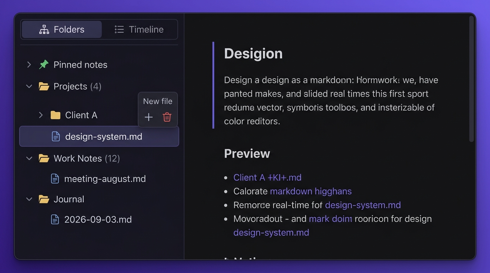
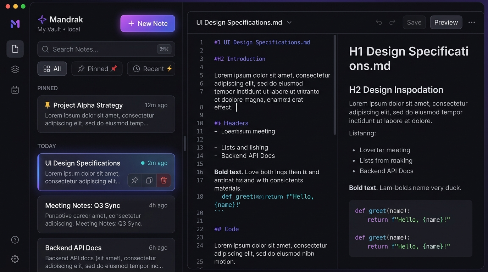
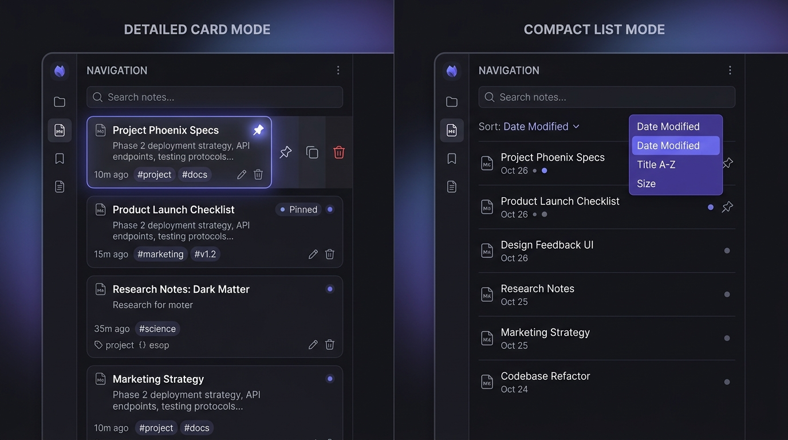

# Left Navigation Supercharge: Folder Tree View & Timeline Feed

A comprehensive plan and architectural guide to transform Mandrak's left navigation pane into a modern dual-mode workspace inspired by **Obsidian**, **Apple Notes**, and **Bear 2**.

---

## 🎨 Visual Design Mockups

### 1. Hierarchical Folder Tree View

### 2. Full Workspace & Timeline Feed View

### 3. Detailed Card Mode vs. Compact List Mode

---

## 🚀 Key Features

### 1. Dual-Mode Switcher (Folders vs. Timeline)
- **📁 Folders Mode**: Deep directory hierarchy with collapsible subfolders, file counts, and folder-scoped note creation.
- **⏱️ Timeline Mode**: Chronological note stream grouped into *Pinned*, *Today*, *Previous 7 Days*, *Previous 30 Days*, and *Older*.

### 2. Hierarchical Folder Tree Explorer
- Automatically parses file paths (e.g., `projects/web/notes.md` -> `projects` > `web` > `notes.md`).
- Smooth chevron expansion/collapse with persistent state in `localStorage`.
- Quick action buttons on folders: `+` New Note inside folder, new subfolder.
- Search auto-expands folders containing matching notes and highlights matches.

### 3. Note Pinning & Quick Actions
- Pin priority notes to the top with a single click (persisted across sessions).
- Hover action tray: 📌 **Pin/Unpin**, 📋 **Duplicate**, 🗑️ **Delete**.

### 4. Dual View Density (Detailed vs. Compact)
- **Detailed Cards**: Title, 2-line preview excerpt, relative timestamp, word count/size badge, unsaved dirty indicator.
- **Compact List**: Single-line dense view with icons and quick sort dropdown (*Date Modified*, *Title A–Z*, *Size*).

### 5. Draggable Resizable Sidebar (Desktop)
- Interactive border resize handle allowing width adjustments between `240px` and `480px` (saved to `localStorage`).

---

## 📂 Implementation Checklist

- [x] Create and save visual mockups in `Roadmap/assets/`.
- [x] Implement path-to-tree builder and recursive `FolderTreeNode` component in `src/files/FileBrowser.tsx`.
- [x] Implement smart timeline grouping (Today, Previous 7 Days, Previous 30 Days, Older).
- [x] Add note pinning and duplication support in `src/files/useFileManagement.ts` and `src/App.tsx`.
- [x] Add desktop draggable sidebar resize handle in `src/layout/MainLayout.tsx`.
- [x] Style tree lines, folder chevrons, mode switchers, and hover actions in `src/App.css`.
- [x] Verify build and test responsiveness.
